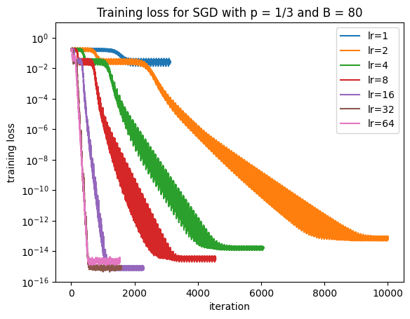

# Continuous matrix completion

In 2025, I undertook a undergraduate research project that aimed to:

- Benchmark the performance of stochastic gradient descent (SGD) and [Adam](https://arxiv.org/abs/1412.6980) against [alternating steepest descent (ASD)](https://www.sciencedirect.com/science/article/pii/S1063520315001062?via%3Dihub) in the context of matrix completion.
- Show that bilinear interpolation can be used to improve the performance of completion algorithms.
- Test how mini-batching affects the performance of ASD.

This repo contains the code used to conduct the experiments for my project. More specifically:

- `utils.py` contains the functions used to run the completion algorithms.
- `Experiment.ipynb` is used to run the experiments.

## Experiment results

### Completing synthetic data

